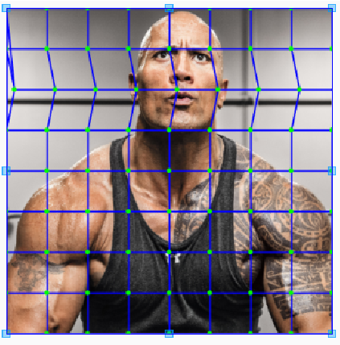
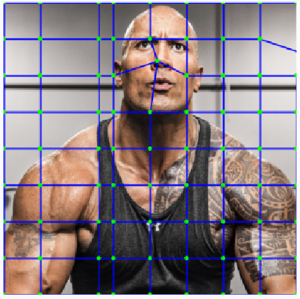
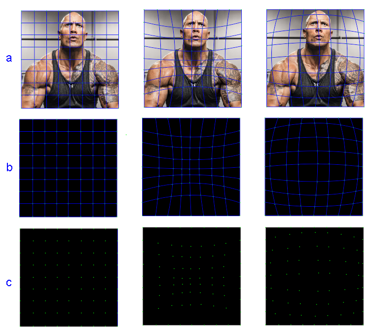

[](http://www.repostatus.org/#active)

WobbleImageView
=============
An Imageview with an easy Wobble/Mesh-Warp  capability.

## Quick Start

> **GRADLE**

```xml
   dependencies {
        implementation 'com.github.54LiNKeR:WobbleImageView:1.0.0'
    }
```

> **XML**


```xml
   <linkersoft.blackpanther.wobble.WobbleMeshImageView
       android:layout_width="200dp"
       android:layout_height="200dp"
       android:layout_gravity="center"
       android:id="@+id/wobbler"
       android:src="@drawable/dwayne_mesh"
       app:wobbleRows="8"
       app:wobbleColumns="8"
       app:drawMeshGrid="true"
       />
```


```xml
   <linkersoft.blackpanther.wobble.WobbleMeshImageView
       android:layout_width="200dp"
       android:layout_height="200dp"
       android:layout_gravity="center"
       android:id="@+id/wobbler"
       android:src="@drawable/dwayne_mesh"
       app:wobbleRows="8"
       app:wobbleColumns="8"
       app:wobble="[c]2#(25,0)"
       app:drawMeshGrid="true"
       />
```



```xml
   <linkersoft.blackpanther.wobble.WobbleMeshImageView
       android:layout_width="200dp"
       android:layout_height="200dp"
       android:layout_gravity="center"
       android:id="@+id/wobbler"
       android:src="@drawable/dwayne_mesh"
       app:wobbleRows="8"
       app:wobbleColumns="8"
       app:wobble="[r]2#(10,0)"
       app:drawMeshGrid="true"
       />
```



```xml
   <linkersoft.blackpanther.wobble.WobbleMeshImageView
          android:layout_width="200dp"
          android:layout_height="200dp"
          android:layout_gravity="center"
          android:id="@+id/wobbler"
          android:src="@drawable/dwayne_mesh"
          app:wobbleRows="8"
          app:wobbleColumns="8"
          app:wobble="[c]2#(30,0)~[r|c]1,8#(10,20)~[r|c]2,4#(10,-20)"
          app:drawMeshGrid="true"
          />
```

```xml
    <linkersoft.blackpanther.wobble.WobbleMeshImageView
       android:layout_width="200dp"
       android:layout_height="200dp"
       android:layout_gravity="center"
       android:id="@+id/wobbler"
       android:src="@drawable/dwayne_mesh"
       app:wobbleRows="8"
       app:wobbleColumns="8"
       app:wobble="@drawable/your_wobble_mask"
       app:drawMeshGrid="false"
       />
```



> **JAVA**

  ```java
  
  public class wobble extends AppCompatActivity {

    WobbleMeshImageView woah;
    @Override
    protected void onCreate(Bundle savedInstanceState) {
        super.onCreate(savedInstanceState);
        setContentView(R.layout.wobble);
        woah=(WobbleMeshImageView)findViewById(R.id.wobbler);
        woah.setOnClickListener(new View.OnClickListener() {
            @Override
            public void onClick(View v) {
                  ((WobbleMeshImageView)v).setWobbleMesh(woah.getWobbleWidth(),woah.getWobbleHeight(),R.drawable.wobble_mask1,null);
            }
        });

    }


}
  
  ```
> public-methods

> `setWobbleMesh(int WobbleWidth,int WobbleHeight,float[] wobbleVerts,String Wobble)`

> `setWobbleMesh(int WobbleWidth,int WobbleHeight,Bitmap WobbleMaskBitmap,String Wobble)`

> `getWobbleWidth()`

> `getWobbleHeight()`

> `setWobbleMask(int ResId)`

> `getWobbleMesh()`

> `getWobbleMask()`

> `getWobble()`
