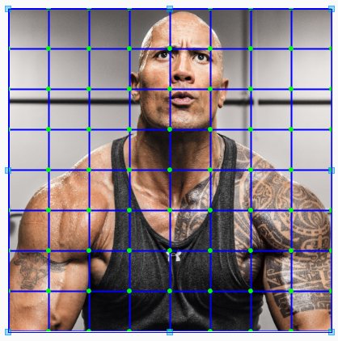
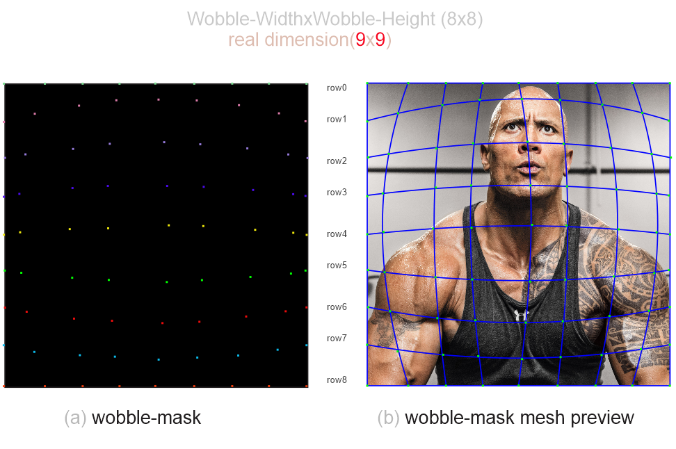
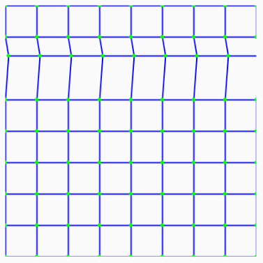
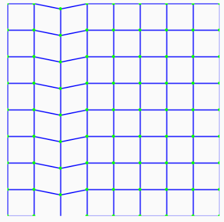
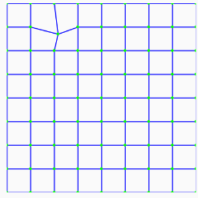
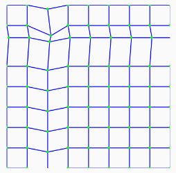
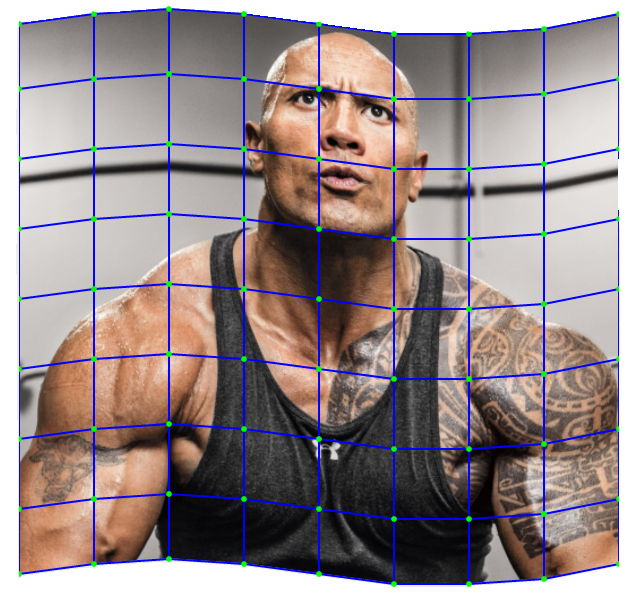
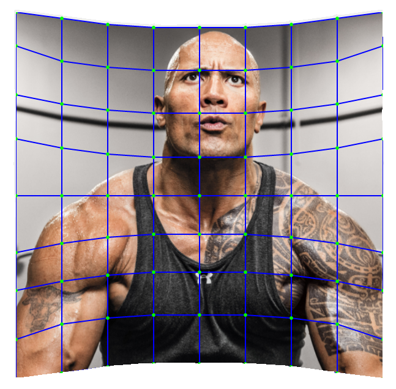

 

[](http://www.repostatus.org/#active)

WobbleImageView
=============
An Imageview with an easy Wobble/Mesh-Warp  capability(Well it thinks it does).

## Quick Start

> **GRADLE**

```xml
   dependencies {
        implementation 'com.github.54LiNKeR:WobbleImageView:1.0.0'
    }
```

> **XML**

**1. Creating The Mesh**

`Disclosure:` ok before you go on... I have to inform you that there may be some jargon included in the fine prints, I encourage you not to allow that bring you down concerning your quest to wobble, do not allow anything stop or discourage you from reading through and wobbling afterwards, also be sure to try your hands on the code... so it all makes sense

 The size of your Mesh is always **=** `((MeshWidth/wobbleColumns)+1) * ((MeshHeight/wobbleRows)+1) * 2` and
 by default this is how to create a new mesh over the ImageView



```xml
   <linkersoft.blackpanther.wobble.WobbleMeshImageView
       android:layout_width="200dp"
       android:layout_height="200dp"
       android:layout_gravity="center"
       android:id="@+id/wobbler"
       android:src="@drawable/dwayne_mesh"
       app:wobbleRows="8"
       app:wobbleColumns="8"
       app:drawMeshGrid="true"
       />
```

If you like, you can load a custom wobble-mesh-mask via the wobble attribute `app:wobble` i.e. `app:wobble=@drawable/your-wobble-mask`.
  
  - your-wobble-mask must be a bitmap where each row of your mesh is a collection of pixels corresponding its nodes  also
    each row of pixel nodes must be a different color from all other rows of pixels that make up the mesh e.g.



  - Also if your-wobble-mask's dimension is not the same as your ImageView's dimension the mesh is scaled to fit the ImageView.
  
>  _**N.B** your node should be 1px in size_

**2. Warping The Mesh**

This is done via the wobble attribute `app:wobble` and there are three ways to warp the ImageView namely:


   | Warping | Syntax | Example | # |
   |----------|---------|--------|:---:|
   | by Shifting the rows | `app:wobble=[r]rowIndex#(xShift,yShift)` | **[r]2#(5,-20)**| cute |
   | by Shifting the columns | `app:wobble=[c]columnIndex#(xShift,yShift)` | **[c]2#(0,10)**| fine |
   | by Shifting any node | `app:wobble=[r\|c]rowIndex,columnIndex#(xShift,yShift)` | **[r\|c]1,2#(8,15)**| pretty |

in order to Shift multiple **rows/columns/nodes** at the same time here's how:

- via Shifting the rows
   - `app:wobble=[r#extra-rowIndices]rowIndex#(xShift,yShift)` e.g. **[r#2]2#(5,-20)**
- via Shifting the columns
   - `app:wobble=[c#extra-columnIndices]columnIndex#(xShift,yShift)` e.g. **[c#-2]6#(0,10)** (*the minus indicates direction i.e. 2 columns above the supposed*)
- via Shifting any node
   - `app:wobble=[r|c#extra-nodes]rowIndex,columnIndex#(xShift,yShift)` e.g. **[r\|c#r2]1,2#(8,15)**,**[r\|c#c3]1,2#(8,15)** (*r2 **=>** 2 extra nodes along corresponding row, c3 = 3 extra nodes along corresponding column*)

## Examples

# 1. Simple Ones

```xml

        <linkersoft.blackpanther.wobble.WobbleMeshImageView
               android:layout_width="200dp"
               android:layout_height="200dp"
               android:layout_gravity="center"
               android:id="@+id/wobbler"
               android:src="@drawable/dwayne_mesh"
               app:wobble="[r]3#(15,-10)"
               app:wobbleRows="8"
               app:wobbleColumns="8"
               app:drawMeshGrid="true"
               />
```

   | # | `app:wobble` | Result |
   |:---:|:---:|--------|
   | cute | `[r]2#(5,-20)` |  |
   | fine | `[c]2#(0,10)` |  |
   | pretty | `[r\|c]1,2#(8,15)` |  |
   | cute+fine+pretty | `[r]2#(5,-20)~[c]2#(0,10)~[r\|c]1,2#(8,15)` |  |


# 2. Complex Ones



```xml

      <linkersoft.blackpanther.wobble.WobbleMeshImageView
             android:layout_width="200dp"
             android:layout_height="200dp"
             android:layout_gravity="center"
             android:id="@+id/wobbler"
             android:src="@drawable/dwayne_mesh"
             app:wobble="[r]0#(0,15)~[r|c]0,0#(0,10)~[r|c]0,2#(0,-5)~[r|c]0,4#(0,10)~[r|c]0,5#(0,20)~[r|c]0,6#(0,20)~[r|c]0,7#(0,15)~
                         [r]1#(0,15)~[r|c]1,0#(0,10)~[r|c]1,2#(0,-5)~[r|c]1,4#(0,10)~[r|c]1,5#(0,20)~[r|c]1,6#(0,20)~[r|c]1,7#(0,15)~
                         [r]2#(0,10)~[r|c]2,0#(0,10)~[r|c]2,2#(0,-5)~[r|c]2,4#(0,10)~[r|c]2,5#(0,20)~[r|c]2,6#(0,20)~[r|c]2,7#(0,15)~
                         [r]3#(0,5)~[r|c]3,0#(0,10)~[r|c]3,2#(0,-5)~[r|c]3,4#(0,10)~[r|c]3,5#(0,20)~[r|c]3,6#(0,20)~[r|c]3,7#(0,15)~
                         [r]4#(0,0)~[r|c]4,0#(0,10)~[r|c]4,2#(0,-5)~[r|c]4,4#(0,10)~[r|c]4,5#(0,20)~[r|c]4,6#(0,20)~[r|c]4,7#(0,15)~
                         [r]5#(0,-5)~[r|c]5,0#(0,10)~[r|c]5,2#(0,-5)~[r|c]5,4#(0,10)~[r|c]5,5#(0,20)~[r|c]5,6#(0,20)~[r|c]5,7#(0,15)~
                         [r]6#(0,-10)~[r|c]6,0#(0,10)~[r|c]6,2#(0,-5)~[r|c]6,4#(0,10)~[r|c]6,5#(0,20)~[r|c]6,6#(0,20)~[r|c]6,7#(0,15)~
                         [r]7#(0,-15)~[r|c]7,0#(0,10)~[r|c]7,2#(0,-5)~[r|c]7,4#(0,10)~[r|c]7,5#(0,20)~[r|c]7,6#(0,20)~[r|c]7,7#(0,15)~
                         [r]8#(0,-25)~[r|c]8,0#(0,10)~[r|c]8,2#(0,-5)~[r|c]8,4#(0,10)~[r|c]8,5#(0,20)~[r|c]8,6#(0,20)~[r|c]8,7#(0,15)"
             app:wobbleRows="8"
             app:wobbleColumns="8"
             app:drawMeshGrid="true"
             />
```



```xml

     <linkersoft.blackpanther.wobble.WobbleMeshImageView
            android:layout_width="200dp"
            android:layout_height="200dp"
            android:layout_gravity="center"
            android:id="@+id/wobbler"
            android:src="@drawable/dwayne_mesh"
            app:wobble=" [r|c#r2]0,3#(0,25)~[r|c]0,0#(0,0)~[r|c]0,1#(0,10)~[r|c]0,2#(0,20)~[r|c]0,6#(0,20)~[r|c]0,7#(0,10)~
                         [r]1#(0,-5)~[r|c#r2]1,3#(0,25)~[r|c]1,0#(0,-15)~[r|c]1,1#(0,10)~[r|c]1,2#(0,20)~[r|c]1,6#(0,20)~[r|c]1,7#(0,10)~[r|c]1,8#(0,-15)~
                         [r]2#(0,-5)~[r|c#r2]2,3#(0,20)~[r|c]2,0#(0,-10)~[r|c]2,1#(0,5)~[r|c]2,2#(0,15)~[r|c]2,6#(0,15)~[r|c]2,7#(0,5)~[r|c]2,8#(0,-10)~
                         [r]3#(0,-8)~[r|c#r2]3,3#(0,20)~[r|c]3,0#(0,-10)~[r|c]3,1#(0,5)~[r|c]3,2#(0,15)~[r|c]3,6#(0,15)~[r|c]3,7#(0,5)~[r|c]3,8#(0,-10)~

                         [r]5#(0,8)~[r|c#r2]5,3#(0,-20)~[r|c]5,0#(0,10)~[r|c]5,1#(0,-5)~[r|c]5,2#(0,-15)~[r|c]5,6#(0,-15)~[r|c]5,7#(0,-5)~[r|c]5,8#(0,10)~
                         [r]6#(0,-5)~[r|c#r2]6,3#(0,-20)~[r|c]6,0#(0,10)~[r|c]6,1#(0,-5)~[r|c]6,2#(0,-15)~[r|c]6,6#(0,-15)~[r|c]6,7#(0,-5)~[r|c]6,8#(0,10)~
                         [r]7#(0,-5)~[r|c#r2]7,3#(0,-25)~[r|c]7,0#(0,15)~[r|c]7,1#(0,-10)~[r|c]7,2#(0,-20)~[r|c]7,6#(0,-20)~[r|c]7,7#(0,-10)~[r|c]7,8#(0,15)~
                                     [r|c#r2]8,3#(0,-25)~[r|c]8,1#(0,-10)~[r|c]8,2#(0,-20)~[r|c]8,6#(0,-20)~[r|c]8,7#(0,-10)""
            app:wobbleRows="8"
            app:wobbleColumns="8"
            app:drawMeshGrid="true"
            />
```

> Just incase all have said is hasn't made sense(well let's hope so even if not), here are some samples with some more meaningful meanings

 | sample<br>`app:wobble` | meaning |
 |:---:|---------|
 | `[c]0#(0,5)` | shift column 0 by x=>0 and y=>5  |
 | `[c]2#(10,0)` | shift column 2 by x=>10 and y=>0  |
 | `[c#-1]2#(10,0)` | shift column 2 and column (2-1) by x=>10 and y=>0 |
 | `[r\|c]1,8#(10,20)` | shift node @ (1,8) by x=>10 and y=>20 |
 | `[r\|c#c2]1,8#(10,20)` | shift nodes @ (1,8),(1,9),(1,10) by x=>10 and y=>20 |
 | `[r\|c#c-2]1,8#(10,20)` | shift nodes @ (1,8),(1,7),(1,6) by x=>10 and y=>20 |
 | `[r\|c#r2]1,8#(10,20)` | shift nodes @ (1,8),(2,8),(3,8) by x=>10 and y=>20 |
 | `[r]4#(6,5)` | shift row 4 by x=>6 and y=>5 |
 | `[r#-3]5#(6,5)` | shift row 5,row 4,row 3,row 2 by x=>6 and y=>5 |
 | `[r#3]5#(6,5)` | shift row 5,row 6,row 7,row 9 by x=>6 and y=>5 |


> **JAVA**

  ```java
  
     WobbleMeshImageView woah;//please don't think of Noah, Not the Ark please!!! ( one can't be sure somebody didn't pronounce Wo-Ah these days, but I hope you didn't)

     @Override
     protected void onCreate(Bundle savedInstanceState) {
         super.onCreate(savedInstanceState);
         setContentView(R.layout.wobble);

         final Context context=this;
         woah=(WobbleMeshImageView)findViewById(R.id.wobbler);
         woah.setOnClickListener(new View.OnClickListener() {
             @Override
             public void onClick(View v) {
                  Bitmap Mask = woah.getWobbleMask(new int[]{ 0xFFA8A8A8,0xFFBDCBB7,0xFFA3BDBF,
                                                              0xFFF3F2E6, 0xFFBECEC2,0xFFF4E8F7,
                                                              0xFFC3D9D9, 0xFF4E4F4F,0xFFFAC8CA });
                  verifyStoragePermission((Activity)context);
                  saveMask(Mask,"masquerade.png");

//                woah.setWobbleMesh(woah.getWobbleWidth(),woah.getWobbleHeight(),R.drawable.wobble_mask1,null);
//                woah.setWobble("[r|c]4,5#(-25,0)");
             }
         });


     }
```

>  [`full-source`](app/src/main/java/linkersoft/blackpanther/wobblemeshimageview/wobble.java)

| **abscondees**   | **returnees**  |
|  :---: | :---: |
| `setWobbleMesh(int WobbleWidth,int WobbleHeight,float[] wobbleVerts,String Wobble)`| *void* |
| `setWobbleMesh(int WobbleWidth,int WobbleHeight,Bitmap WobbleMask,String Wobble)`| *void* |
| `setWobbleMesh(int WobbleWidth,int WobbleHeight,int WobbleMaskResId,String Wobble)`| *void* |
| `getWobbleWidth()`| *int* |
| `getWobbleHeight()`| *int* |
| `getWobbleMesh()`| *float[]* |
| `getWobbleMask()`| *Bitmap* |
| `getWobbleMask(int[] rowColors)`| *Bitmap* |
| `getWobble()`| *String* |

## Extra
 Incase you have interest in creating meshes with say 100 nodes and above and you are familiar with corel-draw I have
 provided a [`gist`](https://gist.github.com/zealbell/8764e61c008d357d2cabfea77905746c) where you can use a macro to get 
coordinates of selected nodes any time you want to draw your mesh. I am 
 very aware one can't be so perfect drawing pixel by pixel in corel-draw, most especially with dimensions not being exact 
even after taking off the anti-aliasing, if you use photo-shop well, I am not sorry about typing this, GFY (Yes it is what 
you're thinking, but I didn't say it). Tbh I just hate photo-shop (I mean, it's better than corel-draw but yes the more reason). 
The first time I used photo-shop my fingers got numbed, my left thumb just wouldn't tap the right click button every time I was about 
to engage the bezier tool, worst was the erazer tool, I almost lost my vision, visited an opthamologist who recommended corel-draw, 
he told me as I dragged the eraser tool my pupils started to shrink because it was actually erasing my eye cells, that was why I 
erased the entire document I was previously working on (I was trying to spice up a client's photo). My pupils got so small that things appeared 
bigger (I mean, a small line suddenly became an entire document in just 2 minutes of clicking, it wasn't wonderful). The opthamologist adviced 
I should update my corel-draw to the latest version to make the healing process faster (Yes it worked) and then after the last checkup we had 
post healing clinic gist, he told me about a dude whose pupil had gone to next level and beyond, some 4nm kevin-hart-extreme, the short sightedness 
was shortly short, obviously the eraser tool was the culprit parasite, I felt very bad for the dude but not surprisingly I took my feelings back because 
I needed some more sanity, moreover the doctor said at that stage the infection was communicable at the slight provocation of a thought about using photoshop, 
he was too blind to observe the physical world, he could only see unicellular 
organisms because his short sightedness was about a 10nm field of view, the scary part was that he said only a 10yrs in advance corel-draw update 
could undo the damage.

 
> Ok that was really stupid! and really really dumb! no doubt! 
> but you get the idea, human creativity is a function of stupidity,  
> Mathematically --> `creativity = stupidity + craziness`
> Don't get me wrong, I am not in any way implying am dumb, 
> I am just saying we all are collectively stupid as humans😵,
> Atleast for reading up to this point you partook in some curious and 
casual stupidity👀.
